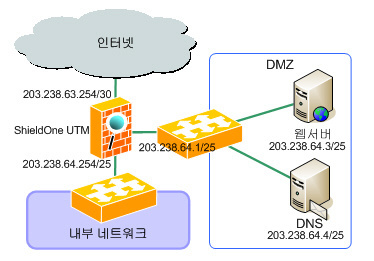

케이스 스터디
===============

이 매뉴얼을 ... 하여 ... 합니다. 

구성도 및 구성개요
^^^^^^^^^^^^^^^^^^

인터넷 관문에 ShieldOne UTM을 설치하여 내부 네트워크를 보호하고 별도로 DMZ 네트워크를 만들어 외부로 서비스하는 웹 서버와 DNS 서버를 DMZ에 연결한 뒤 서비스를 제공합니다.
인터넷 연결은 메트로 이더넷연결로 연결 IP주소는 203.238.63.254이고 넷마스크는 255.255.255.252입니다. 
그리고 인터넷사업자로 부터 할당받은 IP 주소는 C 클래스 IP 203.238.64.0이고 
이를 두개의 네트워크로 분리하여 하나는 DMZ에 사용하고 나머지는 내부 네트워크 주소로 사용합니다.

Shieldone GUI 접속하기
^^^^^^^^^^^^^^^^^^^^^^^^^

공장 초기화 상태의 접속 ip는 192.168.10.1 입니다.
Eth0 포트에 연결 후 설정 PC 또는 노트북 ip를 192.168.10.0/24 대역으로 설정합니다.
설정 후 웹 브라우저에서 https://192.168.10.1:8080 를 통해 SSL 프로토콜을 사용하여 접속합니다.
사설 인증서를 이용하기 때문에 아래 사진과 같이 보안 인증 경고 메시지가 나타납니다.
사진의 빨간 박스 부분을 클릭해 GUI 페이지로 이동합니다.

Shieldone 공장 초기화 상태에서는 계정이 존재하지 않습니다.
로그인창에서 login 버튼을 누르면 관리자 계정 생성 페이지가 나옵니다.
관리자 계정 생성 후 다시 로그인을 합니다.

Ex) Default 계정은 shieldone password plusi 입니다.

인터페이스 설정
^^^^^^^^^^^^^^^^^

Shieldone 인터페이스 설정은 메인화면 왼쪽 메뉴의
구성 -> 인터페이스 설정에서 하실 수 있습니다.
인터페이스 설정을 클릭 하시면 각 인터페이스에 설정된 ip 와 상태를 보여줍니다.
Ex) Name = 역할명

인터페이스 설정 오른쪽 구성 탭의 편집 버튼을 클릭하면 각 인터페이스에 대한 설정을 하실 수 있습니다.

편집 버튼 아래의 ip추가 버튼을 클릭 하시면 secondary ip 설정을 하실 수 있습니다.

방화벽 및 IPS 구성
^^^^^^^^^^^^^^^^^^^

1. NAT 설정 
--------------

NAT는 내부 IP 주소를 사설 IP 주소로 사용할 때 설정한다.
방화벽 메뉴의 NAT 항목을 클릭 하고 WAN1 에 대해 NAT를 활성화여
인터넷 공유를 활성화 시킨다.

2. 방화벽 구성을 위한 객체 설정
--------------------------------

2-1. 호스트, 네트워크 등록 

방화벽 정책에 등록할 ip 그룹을 설정하기 위해서는 호스트, 네트워크 사전 등록을 해야합니다.
오른쪽 메뉴에서 객체설정 버튼을 클릭하면 나오는 하위 메뉴에서 호스트, 네트워크 메뉴를 클릭합니다. 
호스트, 네트워크명 과 ip주소, 대역 입력 후 확인 버튼을 클릭합니다.

2-2. IP그룹 설정

호스트, 네트워크 사전등록을 마친 후 IP그룹설정을 하기위해 IP그룹 탭으로 이동합니다.
다음과 같이 IP그룹을 설정해 줍니다.

추가 버튼을 클릭하고 그룹설정 할 호스트 또는 네트워크를 추가 합니다.
오른쪽 왼쪽 리스트가 동일해야 설정이 가능합니다. Ex) 호스트, 호스트 네트웍대역, 네트웍대역

3. 방화벽 정책 설정
--------------------------

Shieldone 메뉴의 방화벽 메뉴의 방화벽 설정 탭으로 이동합니다. 
다음 그림과 같이 외부 -> DMZ 로 설정 후 추가버튼을 클릭합니다.

DNS 서비스 허용을 예로 들어 보겠습니다.
다음 그림과 같이 방화벽 룰 추가 화면에서 소스는 "ANY" 목적지는 "DNS" 서비스는 "DNS" action은 "Accept" 그리고 활성화를 "on" 한 뒤 "확인" 버튼을 클릭하여 추가합니다.

마찬가지로 웹서버와 WEB 서비스에 대해서도 방화벽 룰을 추가합니다.
외부에서 DMZ으로 외부에서 내부로 앞서 설정된 서비스외 모든 서비스를 제한하는 방화벽 룰을 추가합니다. 
아래의 그림은 예시 입니다.

# 서비스 리스트에 운영하는 서비스가 없을 경우
객체설정의 서비스그룹 탭을 클릭하고 추가버튼을 클릭합니다.

각 항목의 설정값을 입력 후 확인 버튼을 클릭합니다
Search 부분에서 추가한 서비스를 입력해 확인합니다.

웹 서버 해킹에 대한 IPS 적용
^^^^^^^^^^^^^^^^^^^^^^^^^^^^^^^^^

인터넷에서 누구나 웹서버를 접속할 수 있으므로 해킹의 위험에 노출되어 있어 추가적으로 해킹을 방어할 수 있도록 IPS 설정을 합니다. 

2-2 설정방법 
위에서 설명했던 방화벽 설정 메뉴에서 외부 -> DMZ 설정 후 추가 버튼을 클릭합니다. 
다음의 화면과 같이 룰을 설정하고 Action 값을 Inspection으로 설정합니다.

설정 후 왼쪽 메뉴의 IPS 메뉴를 구성메뉴 중 시그니쳐 관리 메뉴를 클릭합니다.
시그니처 관리 메뉴의 추천시그니쳐적용 버튼을 클릭하고 왼쪽의 적용 버튼을 클릭합니다.
 

본,지사 연결을 위한 VPN 구성
^^^^^^^^^^^^^^^^^^^^^^^^^^^^^^^^^
1. 구성개요
---------------------------------
인터넷을 통해 본점과 지점을 연결하고자 합니다. 이때 본점과 지점간 VPN을 구성함으로써 안전하게 사내 시스템을 접속하고자 합니다. 본사 내부 네트워크 203.238.64.128/25 네트워크와 지점 네트워크 203.238.33.0/24 네트워크간 통신 시 VPN 터널을 형성한 뒤 인터넷을 통해 데이터를 주고받을 수 있도록 합니다.

2. 본사 설정 방법
-----------------------------------
Shieldone 메뉴의 IPsec VPN -> 지점간 VPN 메뉴를 클릭합니다.
오른쪽 상단의 추가 버튼을 클릭합니다. 
위의 구성개요를 따라 설정값을 입력 후 확인 버튼을 클릭합니다.

원격 VPN IP는 지사의 ShieldOne 장비가 인터넷과 접속하는 IP 주소를 입력합니다.
원격 Subnet 는 지사의 내부망 네트워크대역을 입력합니다.

3. 지사 설정 방법
------------------------------------
위에서 설명한 방법과 동일하게 IPsec VPN 메뉴의 추가버튼을 클릭합니다.
위의 구성개요를 따라 설정값을 입력 후 확인 버튼을 클릭합니다.
 
원격 VPN IP는 본사의 ShieldOne 장비가 인터넷과 접속하는 IP 주소를 입력합니다.
원격 Subnet 는 본사의 내부망 네트워크대역을 입력합니다.
설정하실 때 주의하실 부분은 Phase1 , Phase2 ,PreShared key 항목이 본,지사간 동일해야합니다.

4. 복수 Subnet인 경우
-------------------------------------
내부 Subnet의 개수만큼 VPN을 생성합니다. 
아래의 예는 2개의 Subnet에 대한 구성입니다.
 
 
빨간 박스 부분을 보시면 동일한 원격 VPN IP에 원격 Subnet만 달라진 것을 확인할 수 있습니다.

