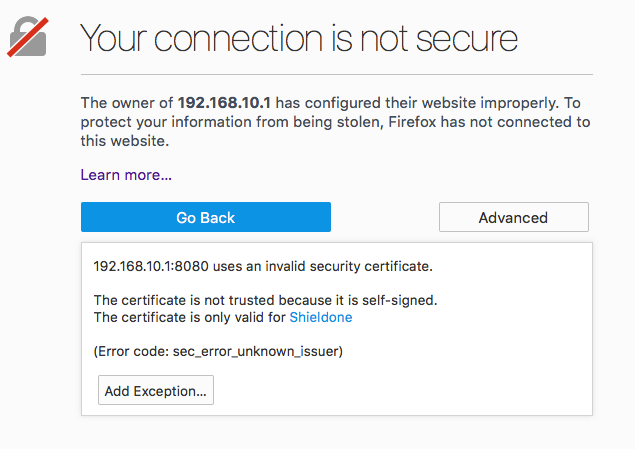
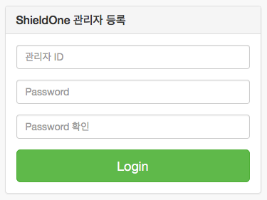
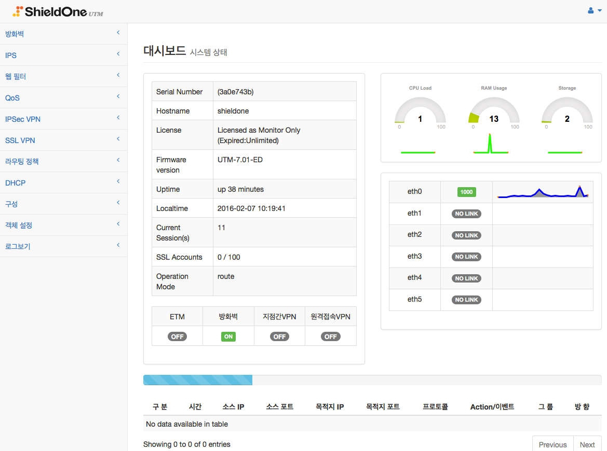
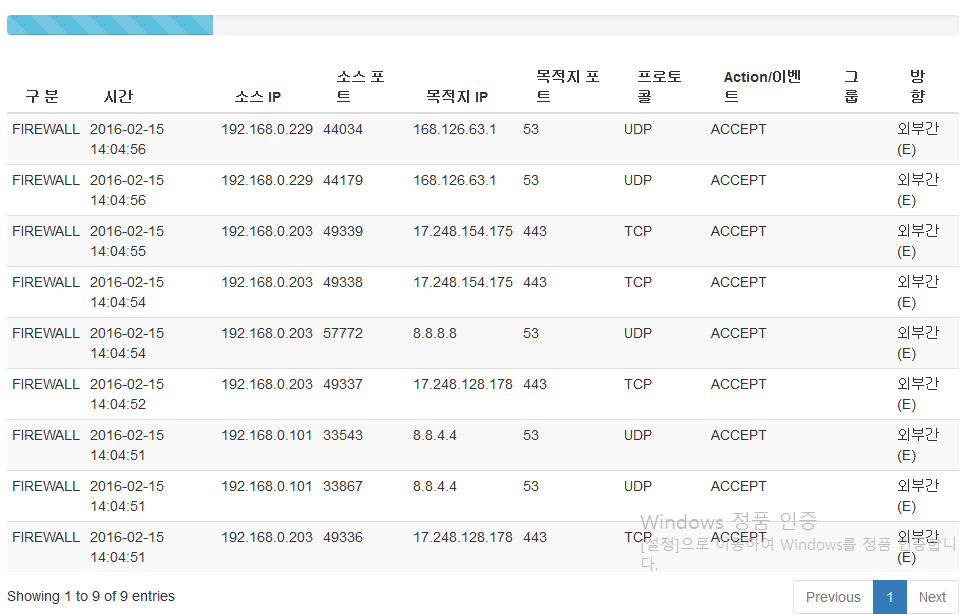
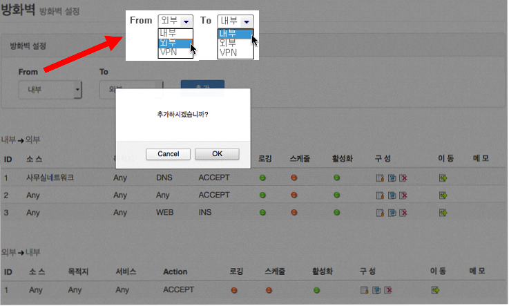
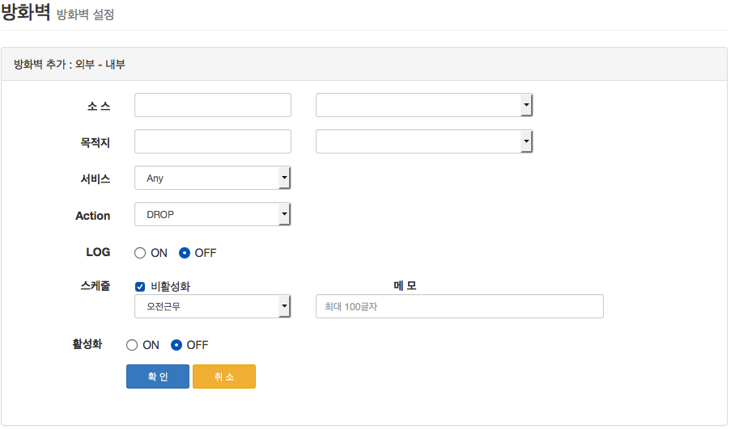

ShieldOne 접속하기
===========================

설정 및 관리를 위해 관리자에게 GUI(Graphical User Interface) 기반으로 기능을 제공하며
ShieldOne의 모든 기능은 GUI 를 통해 설정이 가능하다

.. index:: GUI, 웹브라우저, 공장초기화상태, 접속포트

GUI 접속
--------

1. 설정한 관리자 IP 주고 범위에 있는 컴퓨터에서 웹브라우저를 실행하여 HTTPS 보안 프로토콜을 사용하여 보안 접속을 합니다.
2. 접속하고자 하는 장비의 아이피와 포트를 입력합니다. 공장초기화 상태에서는 ETH0 인터페이스에 https://192.168.10.1:8080 를 입력 합니다.

.. warning::

   웹 브라우저(EDGE, IE, Firefox, Chrome)는 가능 한 최신 업데이트 된 브라우저 사용을 권장 합니다.

3. 접속 포트가 8080 입니다. 사설 인증서를 사용하기 때문에 다음과 같이 보안 인증 경고 메시지가 나타납니다. ‘이 웹 사이트를 계속 탐색합니다(권장하지 않음)’을 선택합니다.

4. ShieldOneUTM은 공장 초기화 상태에서는 기본 계정이 존재하지 않습니다. 아래 왼쪽의 로그인창에서 로그인 버튼을 누르면 입력한 아이디 패스워드는 무시되고 아래 오른쪽의 최초 관리자 등록폼으로 관리자 계정을 먼저 생성 한 후 다시 로그인을 합니다

.. image:: images/c01_2-1.png

5. 정상적으로 로그인이 되었으면 다음의 초기 ShieldOneUTM 대시보드 화면으로 전환 됩니다.

.. image:: images/c01_3.png

.. index:: CLI, RJ45, 시리얼콘솔, console, serial, baud, 속도설정, SSH, Putty

CLI 접속
--------

.. sidebar:: 참고

    콘솔 포트 규격 RJ45 규격을 따릅니다. 한글 입출력이 필요할 때 언어 인코딩은 UTF-8을 사용합니다.

시리얼 콘솔 연결

네트워크를 사용하지 않고 시리얼통신을 통해 CLI를 사용합니다. 연결할 컴퓨터에 COM5, COM6 등의 장치와 Putty 같은 터미널 클라이언트 그리고 파일전송을 위해 rz, sz 프로그램이 필요합니다.

    1. ShieldOne 장비와 같이 제공되는 시리얼 케이블을 사용하여 콘솔로 사용할 컴퓨터와 장비를 연결합니다.
    2. 터미널 클라이언트를 실행하고, 연결에 필요한 값을 입력합니다. (115200N81)
    3. ShieldOne 로그인 프롬프트가 나오면 로그인합니다.

.. sidebar:: 접근제어 설정

    관리(management) 아이피에 대해 ACCEPT 설정이 되어 있어야 합니다.

SSH 연결

    Putty 등의 터미널 클라이언트를 통해 장비의 IP 주소에 접속하여 로그인 합니다. (기본 접속 포트 TCP 22)

    * 로그인 하면 다음과 같은 화면을 볼 수 있습니다.

::

    _________.__    .__       .__       .___________
   /   _____/|  |__ |__| ____ |  |    __| _/\_____  \   ____   ____
   \_____  \ |  |  \|  |/ __ \|  |   / __ |  /   |   \ /    \_/ __ \
   /        \|   Y  \  \  ___/|  |__/ /_/ | /    |    \   |  \  ___/
  /_______  /|___|  /__|\___  >____/\____ | \_______  /___|  /\___  >
          \/      \/        \/           \/         \/     \/     \/

  !          Comments
  admin      Admin mode
  diagnosis  Network Diagnosis mode
  logout     Logout of the current ShieldOne CLI Session
  show       Show System relative information
  system     System Configuration mode

  * Please set charaterset of your terminal UTF-8 for CJK charators

  Welcome [shieldone] it is [Wed Sep 7 11:51:26 KST 2016]
  shieldone@fw-test>

ShieldOne 관리화면 구성
===========================

보안프로토콜을 통해 ShieldOne UTM의 관리자/운영자 계정으로 접속하면 아래와 같은 대시보드(상태화면)이 보여
진다. ShieldOne UTM의 관리 메뉴는 크게 11가지로 나뉘어져 있다.

메뉴 버튼 별 기능 소개
----------------------

+--------------------+------------------------------------------------------------------------+----------+
| 메뉴 버튼          | 기능 설명                                                              | 비 고    |
+====================+========================================================================+==========+
| 방화벽             | 침입 **차단** 시스템의 기능                                            |          |
+--------------------+------------------------------------------------------------------------+----------+
| IPS                | 침입 **방지** 시스템의 기능                                            |          |
+--------------------+------------------------------------------------------------------------+----------+
| 웹필터             | 컨텐츠(URL 또는 트래픽의 데이터)를 감시하여 차단하는 기능              |          |
+--------------------+------------------------------------------------------------------------+----------+
| QoS                | 인터넷 속도(대역폭)를 제한/보장하는 기능                               |          |
+--------------------+------------------------------------------------------------------------+----------+
| IPSec VPN          | IPSec 보안프로토콜을 사용하여 지점 간 VPN을 구성하는 기능              |          |
+--------------------+------------------------------------------------------------------------+----------+
| SSL VPN            | SSL 보안프로토콜을 사용하여 지점 간과 원격 가상 사설망을 구현하는 기능 |          |
+--------------------+------------------------------------------------------------------------+----------+
| 라우팅 정책        | 다중 회선을 사용할 경우 서비스별로 경로 설정하여 분산하는 기능         |          |
+--------------------+------------------------------------------------------------------------+----------+
| DHCP               | DHCP 서버 및 Relay 설정기능                                            |          |
+--------------------+------------------------------------------------------------------------+----------+
| 구성               | WAN, LAN, 사용자관리, DHCP 등 장비의 구성 설정 기능                    |          |
+--------------------+------------------------------------------------------------------------+----------+
| 객체 설정          | 내부 또는 외부의 아이피 범위를 미리 그룹으로 등록하여 사용하는 기능    |          |
+--------------------+------------------------------------------------------------------------+----------+
| 로그보기           | 기능 별 로그 화면 및 트래픽 모니터 기능                                |          |
+--------------------+------------------------------------------------------------------------+----------+

대시보드
--------

ShieldOne UTM 시스템의 현재 상태를 한 화면에 모니터링 하는 기능.

.. image:: images/c02_2.png

1. 시스템의 세부적인 내용을 보여줍니다. 내용은 자동으로 갱신 됩니다.

    * Serial Number : 관리를 위한 장비 고유 번호
    * Hostname : 호스트 이름을 보여 줌
    * License : 현재 라이선스의 종류와 상태를 보여 줌
    * Firmware version : 현재 사용 중인 ShieldOne UTM의 버전을 보여 줌
    * Uptime : ShieldOne UTM 장비의 구동 시간을 보여 줌
    * Localtime : ShieldOne UTM 장비 내부의 시간을 보여 줌
    * Current Session(s) : 현재 내부 네트워크의 세션 수를 보여 줌
    * 기타 : 라이선스 종류와 작동 모드에 따라 관련 정보가 보여집니다.

2. CPU, RAM, Storage 사용량을 그래프로 보여줍니다. 내용은 실시간으로 갱신 됩니다.

3. 각 네트워크 인터페이스들의 링크 상태와 트레픽 상황을 그래프로 보여줍니다.

4. 각 기능 모듈의 작동여부를 표시 합니다. 클릭을 통해 해당기능을 ON/OFF 할 수 있습니다.

5. 이벤트 로그 : 최신 방화벽과 IPS 로그를 보여줍니다. 30초 간격으로 자동 갱신 됩니다.

기능 설명
=======================

방화벽(F/W)
-----------------------

1. 침입차단시스템으로서 NAT모드, Transparent 모드, route 모드를 제공하며, 보안정책에 따라 관리자가 직접 차단 리스트를 입력/수정/삭제 할 수 있으며 프로토콜 별로 발신지(IP, Port) 목적지(IP, Port)를 구별하여 차단 정의를 할 수 있다.
 
 .. image:: images/3-1.png
 
2. 정책에 따라 허가되지 않은 네트워크에서 접근 하는 것을 차단하며, 내부 네트워크를 보호한다.
 
3. 각 Zone에 대해서 네트워크 패킷의 출발지/목적지의 IP 주소, 포트(서비스)가 정책과 일치하면 해당 정책에 대해 설정 된 처리 방법(Action)에 따라 패킷을 허용하거나 차단한다.

4. Zone은 내부, 외부, DMZ, IPSec VPN, SSL VPN, 원격접속 VPN 이 있다.

5. 정책 추가는 다음과 같이 정책을 사용 할 Zone 을 먼저 선택 한 후, 추가 버튼을 누른다.

6. 다음의 추가/수정 폼에 사용 할 방화벽 정책을 입력한다.

7. 각 항목에 대한 설명과 예는 다음과 같다. 
 
 
