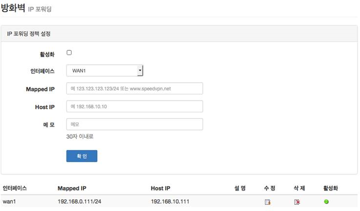
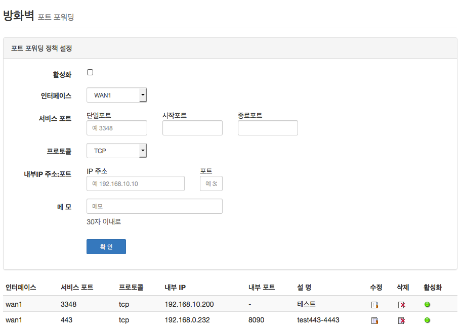
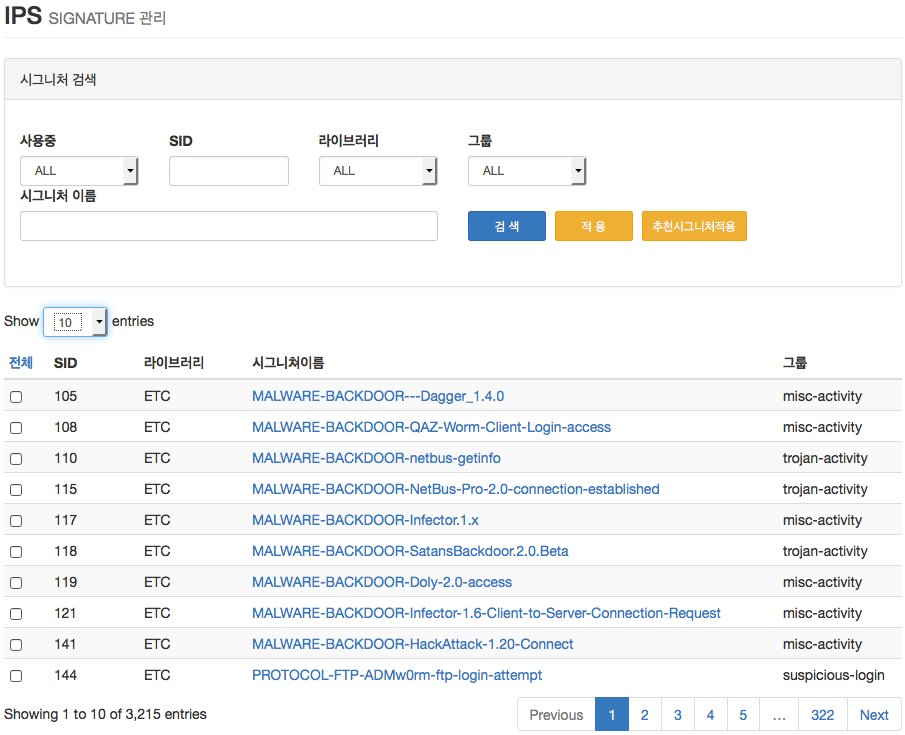
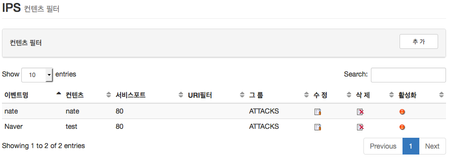
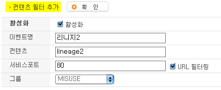
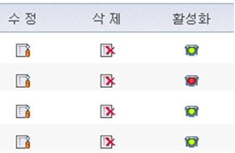
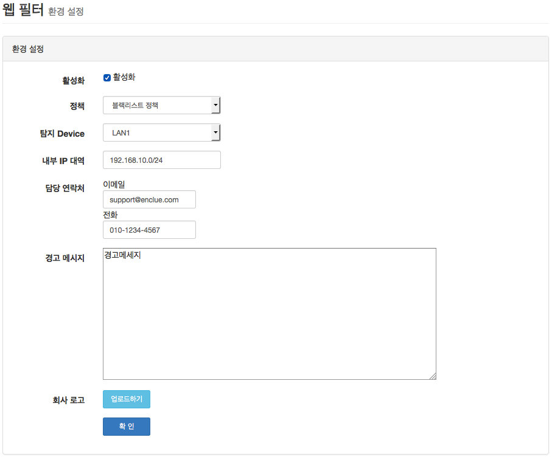
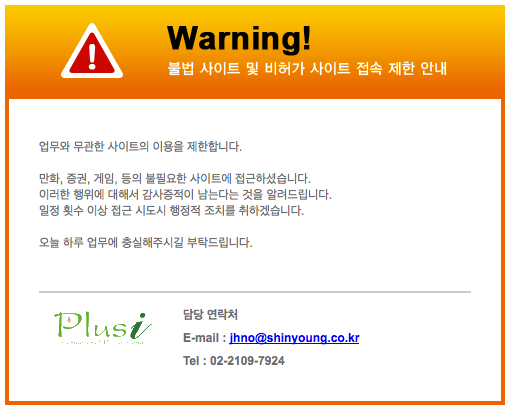
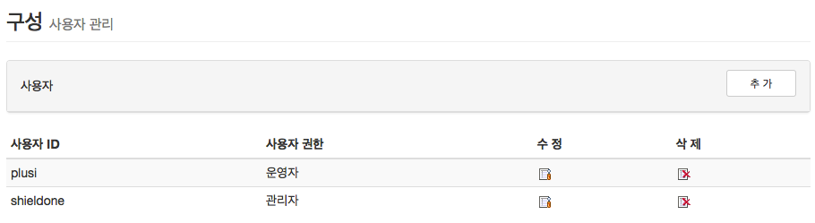

기능 설명
===============

방화벽(F/W)
-----------

1. 침입차단시스템으로서 NAT모드, Transparent 모드, route 모드를 제공하며, 보안정책에 따라 관리자가 직접 차단 리스트를 입력/수정/삭제 할 수 있으며 프로토콜 별로 발신지(IP, Port) 목적지(IP, Port)를 구별하여 차단 정의를 할 수 있다.

 .. image:: images/3-1.png

2. 정책에 따라 허가되지 않은 네트워크에서 접근 하는 것을 차단하며, 내부 네트워크를 보호한다.

3. 각 Zone에 대해서 네트워크 패킷의 출발지/목적지의 IP 주소, 포트(서비스)가 정책과 일치하면 해당 정책에 대해 설정 된 처리 방법(Action)에 따라 패킷을 허용하거나 차단한다.

4. Zone은 내부, 외부, DMZ, IPSec VPN, SSL VPN, 원격접속 VPN 이 있다.

5. 정책 추가는 다음과 같이 정책을 사용 할 Zone 을 먼저 선택 한 후, 추가 버튼을 누른다.

.. image:: images/3-2.png

6. 다음의 추가/수정 폼에 사용 할 방화벽 정책을 입력한다.

.. image:: images/3-3.png

7. 각 항목에 대한 설명과 예는 다음과 같다.

 * 소 스
  * 출발지를 의미하며 미리 정의하거나 직접 입력할 수 있다. (IP 대역 입력 가능)
  * 예) 192.168.2.6 (IP 1개) 172.16.0.0/24 (IP 254개)

 * 목적지
  * 접속하고자 하는 대상으로 미리 정의한 내용을 고르거나 사용자가 직접입력 할 수 있다.
  * 예) ANY (IP 전체), DMZ (DMZ에 속한 그룹)

 * 서비스
  * 특정 포트(서비스)만을 선택하여 정의한다.
  * 예) HTTP, SSH, SSL, 4662, 9553…

 * Action
  * 위의 선택한 나열들의 허용/차단을 정의한다.
  * INSPECTION : 기본값 이상으로 깊이 관찰한다. IPS/웹필터와 연동된다.
  * 예) ACCEPT / DROP / INSPECTION

 * LOG
  * 정의하는 정책들의 접속시도를 로깅한다.
  * 예) 로그보기 ? 보안 로그 ? 방화벽로그

 * 스케쥴
  * 미리 정의한 시간에만 동작하도록 할 수 있다.
  * 예) 근무시간 / 근무외 시간

 * 메 모
  * 나중에 알아보기 쉽도록 메모를 할 수 있다.
  * 예) 웹서버 허용 정책

 * 활성화
  * 생성한 정책을 지우지 않고 ON/OFF 할 수 있다.
  * 예) ON / OFF

IP 포워딩
^^^^^^^^^^^^^^^

1. 1:1 NAT. 내부의 IP 주소와 외부의 IP 주소를 1:1로 연결하여 서비스 하고자 할 때 사용한다

2. 입력/수정 폼과 목록을 통해 다음과 같은 정보를 확인 할 수 있다.

* 인터페이스 : WAN1, WAN2 등 사용 할 외부의 IP 주소를 가진 인터페이스  선택
* Mapped IP : 외부 접속에 사용 될 IP
* Host IP : 내부의 서버 IP
* 활성화 : 사용 여부

포트포워딩
^^^^^^^^^^^^^^^^^

1. 내부의 서버를 지정 한 외부 IP 주소의 지정 한 포트 통해 서비스하는 기능

2. 포트포워딩은 정책 기반의 NAT 설정으로, 일반 NAT에 우선해서 적용된다.

NAT
^^^^^^^^^^^^^^^^^^

 1. NAT는 내부 IP 주소를 사설 IP 주소로 사용할 때 설정한다. NAT 기능을 활성화하기 위해서는 “on”을 선택한다. 그 다음 NAT가 수행될 인터페이스를 선택하고 하단의 “확인” 버튼을 클릭하여 적용하면 된다.

 .. image:: images/3-6.png

 2. NAT POOL 은 M:N NAT 기능으로 특정 네트워크 범위를 정하여 원하는 IP대역으로 NAT 하는 기능

 3. NAT Pool 설정 특정 네트워크 범위를 원하는 인터페이스로 선택하여 NAT를 설정합니다.

 4. NAT Pool설정 방법 1. NAT를 설정할 인터페이스를 선택합니다.

 5. Overload항목을 체크시 선택한 인터페이스 1개로 공인IP가 NAT되어 설정됩니다.

 6. IP Pool항목에 실제로 NAT되어 외부에서 보여질 공인IP 대역대를 설정합니다.

침입방지시스템(IPS)
----------------------

1. 공격형태 및 트래픽 특성에 따라 다양한 차단 기법을 적용함으로써 효율적인 침입대응을 구현한다.

2. IP Spoof, DoS 형태의 비정상 행위와 트래픽 안에 숨겨진 해킹과 웜 바이러스 들을 탐지하여 실시간 차단한다.

3. 침입방지기능은 방화벽 정책에서 INSPECTION 정책이 정의된 트래픽에 대해서만 동작한다.

시그니처 관리
^^^^^^^^^^^^^^^^^^^^^^^

1.  원하는 시그니처의 좌측의 체크박스를 선택 후 '적용' 버튼을 크릭하면 선택/해제 한 것에 대해 개별적으로 적용이 된다.

2. '추천시그니처적용' 버튼을 클릭하면 검증 된 시그니쳐가 적용이 된다.

컨텐츠 필터
^^^^^^^^^^^^^^^^^^^^^^^^^

1. 내용(Contents)에 특정 단어나 문자열을 포함하고 있는 트래픽을 차단하기 위한 정책 수립

2. 유해사이트 차단을 위해 URL 필터링 및 내부정보 유출 방지 등 의 다양한 목적으로 활용

3. 악성 컨텐츠 제거(MIME Type / File Extension(첨부파일) / Java applet, Active X cookie 등등)

  * 컨텐츠 필터 기능은 방화벽 정책에서 INSPECTION 정책이 정의된 트래픽에 대해서만 동작한다.

4. 컨텐츠 필터를 추가하는 방법은 다음과 같다.

특정 단어를 입력하여 필터한다. 예) 리니지2 웹사이트 접속 차단)

추가한 컨텐츠 필터를 수정/삭제 할 수 있으며, 지우지 않고 활성화/비활성화를 통해서 리스트를 유지할 수 있다.

웹 필터
-------------

웹 필터는 업무에 불필요하다고 관리자가 판단한 특정 웹사이트에 접근하지 못하도록 차단합니다.

 1. 업무 특성에 맞게 블랙리스트/화이트리스트 정책 중 하나를 기본으로 사용 할 수 있도록 설정할 수 있다.

 2. 차단 정책에 적용 된 경우 로그에 기록이 되고, 사용자의 웹브라우저는 다음과 같은 페이지가 보이게 된다.

 3. 예외 IP 설정을 통해 이정책을 사용하지 않을 관리자 IP, 특수 IP를 설정할 수 있다.

QOS (Quality of Service)
------------------------------

 .. image:: images/3-13.png

- 대역폭 제한하기

 .. image:: images/3-14.png

 제한할 대역폭을 '제한할대역폭' 란에 입력한다.

 적용포트, 프로토콜, 소스IP, 소스포트, 목적지IP, 목적지포트를 지정한 후 확인 버튼을 클릭한다.

 적용포트는 선택된 인터페이스를 통해 나가는 트래픽에 대해서 적용이 된다.

 소스IP, 소스포트, 목적지IP, 목적지포트 란에  ,(콤마) 로 분리해서 여라 값 입력이 가능하다.

 값 입력을 안하면 모든 값이 된다.

 포트추가에는 eDonkey 등과 같은 알려진 P2P 프로그램 프트 등 을 미리 정의 할 수 있는 기능이다.

- 대역폭 보장하기

 .. image:: images/3-15.png

 대역폭 제한하기와 같다.

IPSec VPN
--------------------------

지점간 VPN 설정  지사나 지방 대리점과 같이 원격지에 있는 사무실간 ShieldOne SIG장비를 이용하여 두 지점을 인터넷을 이용하여 가상의 기업 전용망을 구축하기위해 지점간 VPN을 설정합니다. 노트북 사 용자와 같은 이동 사용자들이나 재택 근무와 같이 별도의 VPN장비를 설치하지 않고 PC에 설 치된 VPN 접속 프로그램을 이용하여 인터넷이 연결되는 곳은 어디서든지 안전하게 사내 네트 워크를 접속할 수 있도록 설정합니다.

지점간 VPN
^^^^^^^^^^^^^^^^^^^^^^

ShieldOne UTM의 IPSec 프로토콜을 이용하여 두 지점을 가성의 기업 전용망으로 구축하기 위한 기능

 .. image:: images/3-17.png

 * 이름 : 원격지 VPN에 대한 이름, VPN 설정 시 관리자가 임의의 이름을 정의 합니다.

 * 인터페이스 : VPN 연결 인터페이스. 통신이 이루어 지는 외부 네트워크 인터페이스(WAN)

 * 내부 Subnet : 내부 사설 네트워크 서브넷

 * 원격 IP : 상대 지점의 IP 주소

 * 원격 Subnet : 상대 지점의 내부 사설 네트워크 서브넷

 * Phase1, Phase2 : IPSec 의 각 Phase 별 사용 알고리즘

 * 활성화 : 해당 VPN 정책을 활성화/비활성화 합니다. 초록색인 경우 활성화 상태입니다.

 * 상태 : 원격지와의 VPN 연결 여부를 나타냅니다. 초록색인 경우 연결 중 상태입니다.

 .. image:: images/3-18.png

 * VPN 구성방식 : 일반적으로 Peer2Peer VPN 을 사용하며, Dynamic VPN 은 인터페이스 IP가 static이 아닌 경우 서버 역할을 하도록, 마찬가지로 Dynamic VPN Subnets 는 상대방이 Dynamic VPN으로 설정 된 경우 사용

 * VPN 이름 : 원격지 VPN에 대한 이름, VPN 설정 시 관리자가 임의의 이름을 정의

 * VPN 연결 인터페이스 : 통신이 이루어 지는 외부 네트워크 인터페이스(WAN)

 * 내부 Subnet : 내부 사설 네트워크 서브넷

 * 원격 IP : 상대 지점의 IP 주소

 * 원격 Subnet : 상대 지점의 내부 사설 네트워크 서브넷

 * Phase1, Phase2 : IPSec 의 각 PHase 별 사용 알고리즘. IKE SA, IPSec SA

 * PreShared Key : 두 VPN 장비 간에 공유 임의의 영문, 숫자로 된 키.

 * PFS : IPSec의 Perfect Forward Security 설정

 * DPD Action : Dead Peer Detection 즉, 연결이 끊어졌을 때 어떤 동작을 취할 것인지 설정

GRE 터널
^^^^^^^^^^^^^^^^^^^^^^^^

 가상의 터널을 만들어 물리적인 경로가 아닌 논리적인 경로를 만들어 통신하는 방법. 주로 IPSec 과 연동하여 터널구간 IP를 사용 하기 위하여 설정하며 자체적인 암호화 기능은 없음.

 .. image:: images/3-19.png

 .. image:: images/3-19-1.png

 GRE 터널의 이름을 입력하고 실제 통신할 사설(혹은 공인)IP를 입력합니다.

 터널에 사용할 IP를 입력합니다. 일반적으로 사설 IP를 입력합니다.

 활성화 여부에 체크를 하고 알아보기 쉽게 메모를 남긴 후 확인 버튼을 클릭합니다.

SSL Remote VPN
-------------------------------

 SSL VPN의 원격접속VPN 기능은 인터넷이 연결 된 곳이면 집이나 출장 중 언제, 어디서나 SSL VPN Client를 이용하여 사무실에 있는 것처럼 모든 업무를 처리할 수 있다.

CA Server
^^^^^^^^^^^^^^^^^^^

 '지역명' 필드에 지리적 위치를 영문으로 입력한다.

 '기관명'에 ShieldOne SIG가 운용중인 기관명을 영문으로 입력한다.

 'E-mail' 필드에 사설 CA서버로 사용될 ShieldOne 장비의 영문이름을 입력한다.

 모든 항목을 정의하고 나서 '확인' 버튼을 클릭하여 CA의 Server인증서를 생성한다.

 .. image:: images/3-20.png

그룹 관리
^^^^^^^^^^^^^^^^^^^^^^^

 .. image:: images/3-21.png

 SSL VPN을 통하여 접근할 때 가상의 IP대역을 설정 해 주는 곳 이다.

 이 화면은 등록 후에는 수정이 불가능 하므로 주의 해야 한다.

 B 클래스로 입력한다.

 .. image:: images/3-22.png

 그룹명 필드에 사용할 이름을 입력한다.

 사용자수 필드에 해당 그룹의 최대 사용자 수를 입력한다.

 인증서 리스트 박스에서 생성 할 그룹이 사용 할 인증서를 선택한다. 이 인증서는 CA Client 메뉴에서 생성한 Client 인증서 목록이다.

원격접속 VPN
^^^^^^^^^^^^^^^^^^^^^^^^^^^

 .. image:: images/3-23.png

 * 프로토콜 : TCP, UDP 선택을 할 수 있다.

 * 접속포트 : 사용할 포트를 설정 할 수 있다.

 * 기본 할당 IP POOL : 그룹관리에서 만든 그룹 중 하나를 선택한다.

 * 내부 Subnet : 내부에서 사용하고 있는 IP 대역을 입력 한다. 예) 192.168.1.0/24
 ,(콤마)를 사용해 여러대역 등록 가능하다.

 * 내부 DNS : 내부에서 사용하고 있는 DNS 주소를 입력한다.

 * VPN G/W 사용 : 원격에 있는 사용자가 인터넷을 사용하고자 할 때 연결된 VPN을 통 해서 ShieldOne SIG을 거쳐서  나가도록 하고자 한다면 사용함을 선택하고 그렇지 않고 위에 설정한 내부 Subnet을 갈 때만 VPN을 사용하도록 한다면 사용안함을 선택한다.

 * MAP IP : 방화벽에서 NAT 되는 공인 IP 설정한다. 예) WAN1 IP 218.38.5.53

 * Time out : 인증 유효성 검사 시간을 설정한다. Default는 60초로 되어있다.

 * 추가인증방법 : 추가로 인증할 방법을 설정 한다. 에)사용자 인증, RADIUS 인증, LDAP 인증

  사용자 인증은 ShieldOne UTM 시스템상에 사용자 인증DB를 사용하며 RADIUS인증은 별도 의 RADIUS인증서버가 있을 때 선택하고 RADIUS서버의 IP주소와 공유키를 정의한다.

CA Client
^^^^^^^^^^^^^^^^^^^^^^^^^^^^^^^^^^^

SSL VPN Client 접속 인증서 파일을 생성 하는 곳이다.

 .. image:: images/3-46.png

 추가 버튼을 클릭하면 인증서를 생성 할 수 있다.

 .. image:: images/3-47.png

 사용자 이름 설정은 인증서의 이름을 설정하는 부분이다.

 패스워드는 인증서의 패스워드를 설정 하는 부분이다.

사용자 관리
^^^^^^^^^^^^^^^^^^^^^^^^^^^^^

 추가인증방법에서 사용자 인증을 사용할 때 사용자들을 생성/관리 하는 메뉴이다.

 .. image:: images/3-48.png

 ID 필드에 사용자 ID를 등록한다.

 그룹 리스트 박스에서 앞서 사용자 그룹에서 설정한 그룹들 중 선택한다.

 사용자의 패스워드를 입력한다.

 사용자에 대한 설명을 입력한다.

 사용자는 이 ID와 패스워드로 접속하면 된다.

 인증서는 모두 같은 Client 인증서 사용 가능하다.

SSL 지점간 VPN
-----------------------------
SL VPN의 지점간 VPN 기능은 IPSec VPN을 I.SP(인터넷 서비스 제공자) 또는 국제망의 정책으로 사용할 수 없거나, 제한적인 경우 TCP/UDP 등의 일반 인터넷 서비스 포트를 이용하여 원격사업장과 인터넷을 통하여 암호화된 안전한 통신 방안을 제공한다. 또한 이동 사용자의 인터넷을 통한 안전한 원격접속 채널을 제공함으로써 언제 어디서나 정보를 공유할 수 있는 환경을 제공한다.

 .. image:: images/3-49.png

 지점간 VPN 상태를 볼 수 있다 추가 버튼을 클릭하면 지점간 VPN 설정을 할 수 있다.

 .. image:: images/3-49-1.png

 Static Key : 한쪽에서 키를 생성하여 하나의 키를 가지고 연결 Staic Key 버튼을 누르면 Key 를 가져올 HOSt 를 입력하는 메뉴가 나온다. 어느 한쪽에 지점간 VPN 설정이 되어 있어야만 키가 생성되어 가져 올 수 있다.

 .. image:: images/3-50.png

 * 장치 ID : 장치의 ID를 입력하는 곳 이다. 숫자만 입력 가능하다.

 * 프로토콜 : TCP_SERVER, UDP, TCP_Client 를 선택 할 수 있다.

 * 연결 IP 또는 도메인명 : 로컬 부분에는 외부로 나가는 장비의 포트 IP를 설정한다. 예) WAN1 IP 218.38.5.53  원격 부분에는 연결할 장비의 외부로 나가는 포트 IP를 입력 한다. 예) WAN1 IP 218.38.6.53

 * 터널 IP : 터널 IP로 사용할 IP를 입력한다. 주로 30bit 서브넷을 사용한다. 예) 10.20.0.1/30

 * 활성화 여부 : 활성화를 하려면 활성화 부분을 체크한다.

 * 메모 : VPN에 대한 설명을 적을 수 있다. 생략해도 활성화 가능하다.

라우팅 정책
------------------

라우트 설정은 ShieldOne에 직접 연결되지 않은 네트워크로 패킷들을 전달할 때 어디로 전달할 지를 판단하는 라우팅 테이블을 입력하는 메뉴이다.

라우팅 정책에는 정책 라우팅, 고정 라우팅, 다이나믹 라우팅, VRRP 설정이 있다.

정책 라우팅
^^^^^^^^^^^^^^^^^^^^
 정책 라우팅이란 특정 조건에 해당하는 패킷을 라우팅 테이블과 상관없이 관리자가 원하는 곳으로 전송시키는 기능을 말한다. 정책에 해당되지 않는 패킷은 라우팅테이블에 따라 전송된다. 정책 라우팅을 사용하면 패킷의 출발지 또는 목적지 주소에 따라 원하는 경로를 선택할 수 있다.

 ShieldOne 메인 메뉴의 라우팅 정책 탭의 정책 라우팅 메뉴에서 상태를 확인 할 수 있다.

 .. image:: images/3-51.png

 추가 버튼을 클릭하면 정책 라우팅을 추가 할 수 있다.

 .. image:: images/3-52.png

 Input : 정책 라우팅이 적용되는 인터페이스를 정의합니다.

 소스 : 소스 IP 주소를 정의합니다. 정의한 소스 IP와 일치하는 패킷들은 정의된 WAN 인터페이스로 나가게 됩니다.

 소스포트 : 소스 포트를 정의합니다. 정의한 소스포트와 일치하는 패킷들은 정의된 WAN 인터페이스로 나가게 됩니다.

 목적지 : 목적지 IP 주소를 정의합니다. 정의한 목적지 IP와 일치하는 패킷들은 정의된 WAN 인터페이스로 나가게 됩니다.

 목적지포트 : 목적지 포트를 정의합니다. 정의한 목적지 포트와 일치하는 패킷들은 정의된 WAN 인터페이스로 나가게 됩니다.

 인터페이스 : 패킷이 나가는 인터페이스를 정의합니다.

 백업 : 인터페이스에서 설정한 곳에 장애가 발생 할 경우 백업할 인터페이스를 정의합니다.

 메모 : 정책 라우팅에 대한 설명을 추가 할 수 있다. 생략해도 정책 라우팅 활성화 할 수 있다.

 기타 : 같은 망 내에 다른 장치로 패킷을 나가게 설정 하기 위해 직접 GW IP, Tunel IP를 설정한다.

 * not 체크박스를 활성화 하면 정의한 IP와 포트만을 제외 시킵니다.

고정 라우팅
^^^^^^^^^^^^^^^^^^^^^

 고정 라우팅 탭을 클릭하면 라우팅 테이블을 확인 할 수 있고, 라우팅 테이블을 추가 할 수 있다.
 Destination 란에 목적지 네트워크를 입력하고 "Netmask"에는 목적지 네트워크에 대한 Subnet mask를 입력한 다음 해당 목적지 네트워크로 향하는 패킷들을 어디로 내 보낼 지 인터페이스를 입력 후 "확인" 버튼을 클릭하여 등록한다.

 .. image:: images/3-53.png

다이나믹 라우팅
^^^^^^^^^^^^^^^^^^^^^

 .. image:: images/3-54.png

 RIP : 라우터 내의 게이트웨이 호스트는 전체 라우팅 테이블을 가장 가까운 인근 호스트에 매 30초마다 보낸다. 인접한 호스트는 자신의 차례가 되면 그 정보를 그 다음 인접한 호스트로 넘기는데, 이러한 전달은 그 네트웍 내의 모든 호스트들이 같은 라우팅 경로 정보를 가질 때까지 계속된다. RIP는 네트웍 거리를 결정하는 방법으로 홉의 총계를 사용한다 (다른 프로토콜들은 타이밍까지를 포함하는 보다 정교한 알고리즘을 사용한다). 네트웍 내에 라우터를 갖고 있는 각 호스트는 패킷을 전달할 다음 호스트를 결정하기 위해 라우팅 테이블 정보를 사용한다.

 .. image:: images/3-54-1.png

 Networks : RIP 을 사용해 라우팅 할 네트워크 대역을 입력한다.  ,(콤마)를 이용해 여러 대역을 입력 할 수 있다.

 Redistribution Routes : 서로 다른 라우팅 프로토콜 간에 라우팅 정보를 주고 받기 위해 사용한다.

 Timer 설정 : 라우팅 테이블 전송 주기, 장애발생시 대기시간, 만료시간을 설정 할 수 있다.

 Update interval : 라우팅 테이블 정보를  인접한 라우팅에게 전송할 주기를 설정 합니다.

 Hold :  정보가 들어오지 않으면 Routing table을 삭제하지 않고 기다리는 시간입니다.

 Expiration : Expiration 에 설정한 시간이 만료되어도 정보가 들어오기 않으면 라우팅 테이블에서 삭제 됩니다.

 OSPF :  라우팅 테이블의 변경 사실이나, 네트웍 내의 어떤 변화를 감지한 호스트는, 즉시 그 정보를 네트웍 내의 다른 모든 호스트들에게 알림으로써, 모두 같은 라우팅 정보를 가질 수 있도록 한다. 라우팅 테이블 전체를 보내는 RIP과는 달리, OSPF를 사용하는 호스트는 오직 변경된 부분만을 보낸다. RIP에서는 매 30초마다 라우팅 테이블을 인접한 호스트에 보내지만, OSPF는 변경이 생겼을 때에만 변경된 정보를 멀티캐스트 한다.

 .. image:: images/3-54-2.png

VRRP 설정
^^^^^^^^^^^^^^^^^^^^

 VRRP(Virtual Router Redundancy Protocol)은 여러 대의 라우터를 그룹으로 묶어 하나의 가상 IP 어드레스를 부여해 마스터로 지정된 라우터 장애시 VRRP그룹 내의 백업 라우터가 마스터로 자 동 전환되는 프로토콜입니다. 본 설정은 VRRP 를 지원하는 모든 Gateway와 연동 가능합니다.

 .. image:: images/3-55.png

 활성화 : VRRP 프로토콜을 활성화 또는 비활성화합니다.

 STATE : 여러대의 라우터 그룹에서 Master 라우터 인지 Backup 라우터 인지 선택합니다.

 인터페이스 : VRRP 그룹으로 묶을 가상 IP 가 속한 네트워크 인터페이스를 지정합니다.

 ID : 여러개의 VRRP 그룹이 있는 경우, 그룹을 구분할 수 있도록 숫자로 된 ID 를 입력합니다.

 Priority : VRRP 그룹에서 설정중인 ShieldOne SIG 의 우선순위를 지정합니다. Priority 숫자가 클수록 Master 로 동작합니다. 이 Priority 값은 Tracking 인터페이스 설정에서 지정한 가중치 만큼 감소하게 되고 만약 그 값이 백업 VRRP 라우터의 Priority 값보다 작아지게 되면 Master 권한을 백업 VRRP 라우터로 이양하게 됩니다.

 인증 패스워드 : VRRP 그룹에 속한 라우터들 간에 통신 시 인증을 위한 패스워드를 입력합니다.

 가상 Gateway IP : VRRP 그룹 라우터들이 사용할 가상의 IP 어드레스를 정의합니다.

 Tracking 인터페이스 : 링크 상태를 주기적으로 체크할 인터페이스를 지정하고 만약 링크 상태가 down 으로 되는 경우, Priority 에서 차감할 값을 정의합니다.

DHCP
-------------------

DHCP 서버
^^^^^^^^^^^^^^^^^^^^^

  DHCP 서버 기능을 설정 할 수 있는 기능이다.

 .. image:: images/3-25.png

 그룹추가를 클릭해서 다음과 같이 값을 설정할 수 있다.

 .. image:: images/3-26.png

 활성화 : 체크하면 활성화를 할 수 있습니다.

 인터페이스 : 할당할 인터페이스를 설정합니다.

 Subnet : 할당할 IP주소가포함된 Subnet을 등록합니다.

 Netmask : 할당되는 IP주소의 Subnetmask를 설정합니다.

 범위 : 할당하려고하는 IP 주소 범위를 시작과 끝주소로 설정합니다.

 게이트웨이 주소 : 할당되는 IP주소의 default gateway를 설정합니다.

 브로드캐스트 : 할당되는 IP주소의 broadcast 주소를 설정합니다.

 DNS : 할당받은 사용자가 사용할 DNS 주소를 설정합니다.

 메모 : 설정된 IP그룹에 대한 정보를 입력합니다.

 DHCP 할당 내용
^^^^^^^^^^^^^^^^^^^^

 DHCP 할당내용 메뉴를 클릭하면 현재 Ip주소를 할당받아 사용중인 DHCP 클라이언트의 리스트와 컴퓨터명 및 MAC주소를 볼 수 있습니다.

 .. image:: images/3-27.png

DHCP 릴레이
^^^^^^^^^^^^^^^^^^^^^

 다중 Subnet에 하나의 DHCP 서버를 사용하고자 할 때 필요합니다.
 내부 네트워크 외 다른 네트워크에 DHCP 서버가 있는 경우에 사용합니다.

 .. image:: images/3-28.png

 DHCP 서버 IP 항목에 실제 DHCP 서버 IP를 입력합니다.

 인터페이스 항목에 Relay 할 네트워크가 연결 되어있는 LAN 인터페이스를 체크합니다.

 적용하기 위해서 활성화 여부를 체크 합니다.

구성
-------------------

인터페이스 설정
^^^^^^^^^^^^^^^^^^^^^^^^

 인터페이스 설정은 ShieldOne이 사용하는 각 인터페이스의 설정된 IP 주소와 상태를 보여준다.

 .. image:: images/3-29.png

 추가 버튼을 클릭하면 다음과 같이 인터페이스 설정을 할 수 있다.

 .. image:: images/3-30.png

시스템 설정
^^^^^^^^^^^^^^^^^^^^^^^^

 .. image:: images/3-31.png

 1. ShieldOne 버전 : 현재 펌웨어 버전과 업그레이드 가능.

 2. Hostname : 장비 관리용 호스트 이름을 변경 한다.

 3. 접근허용 IP : ShieldOne 시스템을 접속 할 수 있는 IP를 정의하는 항목이다. 접근을 허용할 IPfmf 192.168.2.2 192.168.2.3과 같이 허용할 IP주소를  ,(콤마)로 구분하여 입력.

 4. SYSLOG IP : ShieldOne의 이벤트들이나 방화벽 로그들을 원격의 Syslog 서버로 전송하려고 할 때 이 항목에 원겨의 syslog 서버 IP 주소를 입력한다.

 5. SNMP : 이벤트들이나 방화벽 로그들을 SNMP trap으로 SNMP manager로 전달하고자 할 때 Manager IP를 입력하고 사용 중인 SNMP version과 Community를 입력한다.

 6. 환경백업 : 현재 구성된 ShieldOne 설정값들을 로컬 PC에 백업하거나 백업된 구성을 ShieldOne에 적용할 때 사용한다.

 7. DDNS : DDNS는 유동 IP환경에서 자주 변경되는 공인IP를 도메인네임으로 고정하여 접속할 수 있도록 해주는 동적인 네임서비스 입니다. 이를 통하여 유동 IP 사이트간 VPN연결, SSL VPN 접속, 포 트포워딩을 이용한 내부 사설IP서버의 접속등이 가능합니다. 이서비스를 위해서는 엔클루의 DDNS서버에 도메인네임 등록요청을 하면 이용이 가능하며 IP주소변경의 업데이트를 위해 부 여받은 도메인네임과 패스워드를 설정합니다.

사용자 관리
^^^^^^^^^^^^^^^^^^^^^^^^

사용자관리 메뉴는 ShieldOne을 접속할 수 있는 사용자를 등록하는 메뉴이다.

등록할 사용자 ID 와 PASSWORD를 입력한 뒤 확인 버튼을 클릭하면 새로운 사용자가 입력된다.

객체 설정
---------------------------------------

 정책 추가 시 필요한 소스와 목적지 호스트 또는 네트워크를 알아보기 쉽도록 미리 정의한다.

 방화벽 정책에 등록할 ip 그룹을 설정하기 위해서는 호스트, 네트워크 사전 등록을 해야합니다.
 오른쪽 메뉴에서 객체설정 버튼을 클릭하면 나오는 하위 메뉴에서 호스트, 네트워크 메뉴를 클릭합니 다.
 호스트, 네트워크명 과 ip주소, 대역 입력 후 확인 버튼을 클릭합니다.

호스트
^^^^^^^^^^^^^^^^^^^^^^^^^

오른쪽 메뉴에서 객체설정 버튼을 클릭하면 나오는 하위 메뉴에서 호스트 메뉴를 클릭합니다

정책 추가 또는 IP 그룹 생성 시 필요한 호스트를 등록합니다.

 .. image:: images/3-33.png

호스트명란에는 호스트에 대한 설명을 입력 할 수 있습니다.

IP주소란에는 호스트의 IP주소를 입력합니다.

네트워크
^^^^^^^^^^^^^^^^^^^^^^^^^

오른쪽 메뉴에서 객체설정 버튼을 클릭하면 나오는 하위 메뉴에서 네트워크 메뉴를 클릭합니다.

정책 추가 또는 IP그룹 생성 시 필요한 네트워크를 등록합니다.

 .. image:: images/3-34.png

네트워크명란에는 네트워크에 대한 설명을 입력 할 수 있습니다.

네트워크주소란에는 네트워크대역을 입력합니다.

IP 그룹
^^^^^^^^^^^^^^^^^^^^^^^^^
 내부 또는 외부의 아이피 범위를 미리 그룹으로 등록하여 필요한 항목에서 별도의 정의 없이 사용할 수 있습니다.

 IP그룹 메뉴에서 추가버튼을 클릭하여 등록 할 수 있습니다.

 이름란에는 해당 호스트 또는 네트워크를 구별할 수 있도록 이름을 입력하고 그룹설정 할 호스트 또는 네트워크를 추가 합니다.

 오른쪽, 왼쪽 리스트가 동일해야 설정이 가능합니다. Ex) 호스트, 호스트 네트웍대역, 네트웍대역

 .. image:: images/3-35.png

 .. image:: images/3-35-1.png

 IP그룹 목록에서는 다음 정보를 확인할 수 있습니다.

 이름 : IP 그룹 항목의 이름입니다.

 IP/NETMASK : IP주소의 종류입니다(호스트:단일, CIDR:클래스)를 표시 합니다.

 설명 : IP그룹에 대한 설명이 입니다.

 수정 : IP그룹에 대한 정보를 수정 있습니다.

 삭제 : IP그룹을 삭제 할 수 있습니다.

서비스 그룹
^^^^^^^^^^^^^^^^^^^^^^^

 방화벽 정책 추가 시 필요한 서비스들을 정의한다. 서비스 그룹 메뉴로 들어가면 등록되어 있는 서비스 목록들이 보이고 서비스 그룹 추가 버튼을 클릭하여 신규 서비스를 등록한다.

 .. image:: images/3-36.png

 "이름" 항목에는 등록할 서비스를 구별할 수 있는 이름을 입력한다. 그 다음 해당 서비스가 사용하는 프로토콜을 선택한 다음 사용하는 포트 숫자를 입력한다. 여러 포트는  ,(콤마)로 분리한다. "설명" 입력 란에는 등록한 서비스를 쉽게 알아볼 수 있도록 자세한 설명을 입력하면 된다. 시작포트 끝포트를 설정하여 포트범위를 설정 할 수 있다.

 .. image:: images/3-37.png

스케줄 그룹
^^^^^^^^^^^^^^^^^^^^^^

 스케줄 그룹은 방화벽 정책 추가 시 정책이 적용되는 일정을 선택할 때 필요한 스케줄을 정의한다.

 .. image:: images/3-38.png

 "그룹 추가" 버튼을 클릭하여 새로운 스케줄을 추가할 수 있다. "이름"은 등록 할 스케줄을 구별할 수 있도록 이름을 입력하고 시간을 정의한 다음 스케줄의 주기를 요일 별로 선택하고 스케줄에 대한 상세 설명을 입력한다. 설명은 입력하지 않아도 된다.

 .. image:: images/3-39.png

로그 보기
---------------------------------------

보안 로그
^^^^^^^^^^^^^^^^^^^^^^^^^

 ShieldOne UTM 에서 일어나는 모든 상황을 모니터링 할 수 있습니다.

 .. image:: images/3-40.png

 구분 : 어떤 기능에 의해 로그가 생성 되었는지 보여줍니다. FIREWALL, IPS, CONTENTS 세 종류로 분류됩니다.

 시간 : 해당 이벤트가 발생한 시간을 나타냅니다.

 Action / 이벤트 : 방화벽, IPS, 컨텐츠필터에서 설정한 Action 과 이벤트를 나타냅니다.

 그룹 : IPS 기능의 시그니쳐가 속한 그룹을 나타냅니다. ATTACK, VIRUS, TROJAN, COMPROMISE, PROBE, SUSPICIOUS, VULNERVILITY, FAILURES, MISUSE, APPS, NETWORK, ANOMALY 등이 있습니다. 방화벽 로그인 경우 빈칸으로 남습니다.

 방향 : 해당 패킷의 방향을 나타냅니다. F(Forward) 는 내부에서 외부로 가는 트래픽이고 E(External) 는 외부에서 내부로 가는 트래픽입니다.

설정/상태 로그
^^^^^^^^^^^^^^^^^^^^^^^^^

 각 사용자들의 정책 수정 및 기능 사용에 대한 정보를 확인 할 수 있습니다.

 .. image:: images/3-41.png

 발생시간 : 이벤트가 발생한 시간을 나타냅니다.

 모듈이름 : 설정/상태를 체크하는 묘듈이름을 나타냅니다.

 메세지 : 설정/상태 변경을 나타냅니다.

웹필터 로그
^^^^^^^^^^^^^^^^^^^^^^^^

  웹 필터에서 설정 된 룰의 로그를 확인 할 수 있습니다.

  .. image:: images/3-42.png

  시작날짜 :  로그 검색할 시작 날짜와 시간을 설정 합니다.

  소스IP : 출발지 IP를 설정합니다.

  소스포트 : 출발지 포트(요청) 설정 합니다.

  마지막날짜 : 로그 검색할 마지막 날짜와 시간을 설정 합니다.

  목적지IP : 목적지 IP를 설정합니다.

  목적지포트 : 목적지 사용 포트를 설정합니다.

  URL : URL주소 또는 도메인을 설정 합니다.

  검색 : 버튼 클릭시 웹필터 로그를 검색 합니다.

SSLVPN 로그
^^^^^^^^^^^^^^^^^^^^^^^

VPN 접속 및 설정, SSL VPN 연결에 대한 로그를 볼 수 있습니다.

 .. image:: images/3-43.png

세션 로그
^^^^^^^^^^^^^^^^^^^^^^^

 ShieldOne 내부에 있는 호스트의 접속 정보를 나타냅니다.
 시간, 프로토콜, 소스, 목적지 IP 및 포트, 상태 필드로 이루어집니다.

 .. image:: images/3-44.png

 시간 : 로그가 발생한 시간을 나타냅니다.

 프로토콜 : 로그에 남은 해당 패킷이 사용한 프로토콜을 나타냅니다. TCP, UDP, icmp 등이 있습니다.

 소스 : IP 출발지 IP 를 나타냅니다.

 소스 포트 출발지 IP 가 사용하는 포트를 나타냅니다.

 목적지 IP 출발지 IP 가 도착한 목적지 IP 를 나타냅니다.

 목적지 포트 출발한 IP 가 도착한 목적지 호스트의 포트를 나타냅니다.

 상태 : 현재 세션의 상태를 나타냅니다.
 ESTABLISHED : 현재 연결이 되어있는 상태입니다.
 TIME_WAIT : 연결이 완료되괴 대기 상태입니다.
 CLOSE : 연결이 종료된 상태입니다.

사용자 접속 로그
^^^^^^^^^^^^^^^^^^^^^^

각 사용자의 로그인/로그아웃, 인증 실패 내역에 대한 정보를 확인 할 수 있습니다.
발생시간, 접속IP, 아이디, 메세지 필드로 구성되어 있습니다.

 .. image:: images/3-45.png

 발생 시간 : 해당 이벤트가 발생한 시간을 나타냅니다.

 접속 IP : Login 시도 IP를 보여줍니다.

 아이디 : 장비 접속 시도 아이디를 보여줍니다.

 메세지 : login, password failed, ID failed, logout 등과 같은 이벤트를 보여줍니다.

ARP 보기
^^^^^^^^^^^^^^^^^^^^^^

 현재 내부 LAN에서 Shieldone UTM이 참조하고 있는 ARP 테이블 정보를 보여줍니다. ARP보기에서는 다음 과 같은 정보를 확인할 수 있습니다.

 장치 선택 : 내부망에 대해서 선택을 할 수 있습니다.

 검 색 : IP 나 MAC 으로 검색을 할 수 있습니다.

 IP : IP 정보로 확인 할 수 있습니다.

 MAC  : MAC 정보로 확인 할 수 있습니다.

 제조회사 : NIC 제조회사 정보를 볼 수 있습니다.

 .. image:: images/3-56.png
